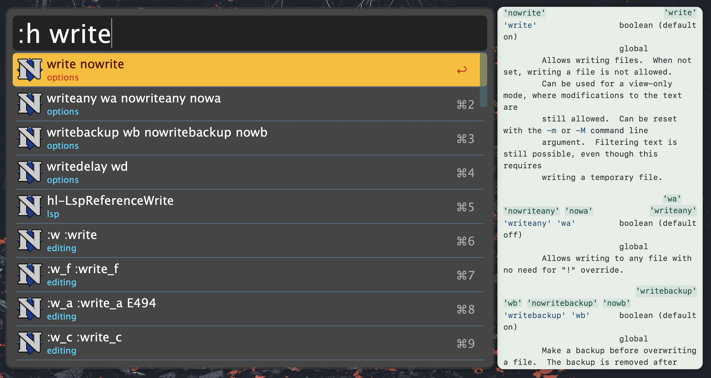
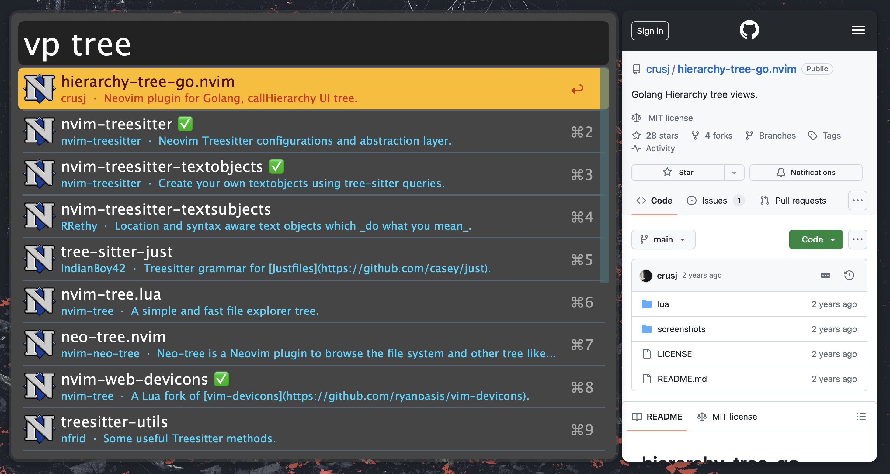

# Neovim Utilities for Alfred
<!--  -->

Search [neovim plugins](https://neovimcraft.com/) and [online :help](https://neovim.io/doc/) via [Alfred](https://www.alfredapp.com/).

## Table of contents
<!--toc:start-->
- [Features](#features)
- [Installation](#installation)
- [Credits](#credits)
- [About me](#about-me)
<!--toc:end-->

## Features
- `:h`: Searches the neovim [online :help](https://neovim.io/doc/). Groups synonyms together, for example, `:w` and `:write` both get one item.
	- `↵`: Open the respective help.
	- `⌥↵`: Copy the help URL to the clipboard.
- `vp`: Searches [neovimcraft](https://neovimcraft.com/) for neovim plugins. Mnemonic: [v]im [p]lugins.
	- `↵`: Open the GitHub repo.
	- `⌘↵`: Copy repo name for plugin managers.
	- `⌥↵`: Copy the GitHub URL to the clipboard.
	- `⌃↵`: Open the `:help` page of the plugin at GitHub.
	- `⇧↵`: Search GitHub issues of the plugin.[^1]
- `ip`: Search for plugins installed locally on your device. Mnemonic: [i]nstalled [p]lugins. The modifiers (`⌘⌥⌃⇧`) from the neovim-plugin-search also apply for this command. In addition:
	- `fn↵`: Open the local directory of the plugin in Finder.
- `:old`: Displays and searches your `:oldfiles`. Opens them in the system's default editor for the respective filetype. (To open them directly in neovim, you need a neovim GUI with "Open With" capability.)
- `:nvim`: Creates/Updates the local cache for the online :help search. Run it once in a while, when there have been updates to the online docs.

## Installation
__Requirements:__
[Alfred 5](https://www.alfredapp.com/) (macOS only) with powerpack.

1. Download the [latest release from the Alfred Gallery](https://alfred.app/workflows/chrisgrieser/neovim-utilities/).
2. Run `:nvim` once to create the local cache for the [online :help](https://neovim.io/doc/) search. This may take up to a minute.

## Credits
- The plugin search would not be possible without the fantastic [Neovimcraft](https://neovimcraft.com/).
- Logo by [@thomascannon](https://github.com/neovim/neovim/issues/43#issuecomment-35811450).

<!-- vale Google.FirstPerson = NO -->
## About me
In my day job, I am a sociologist studying the social mechanisms underlying the digital economy. For my PhD project, I investigate the governance of the app economy and how software ecosystems manage the tension between innovation and compatibility. If you are interested in this subject, feel free to get in touch.

__Profiles__
- [Discord](https://discordapp.com/users/462774483044794368/)
- [Academic Website](https://chris-grieser.de/)
- [GitHub](https://github.com/chrisgrieser/)
- [Twitter](https://twitter.com/pseudo_meta)
- [ResearchGate](https://www.researchgate.net/profile/Christopher-Grieser)
- [LinkedIn](https://www.linkedin.com/in/christopher-grieser-ba693b17a/)

[^1]: Due to GitHub API limitations, this searches only the latest 100 issues.
